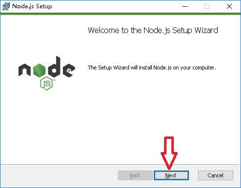
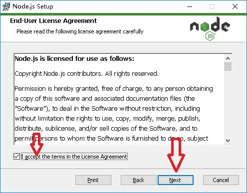
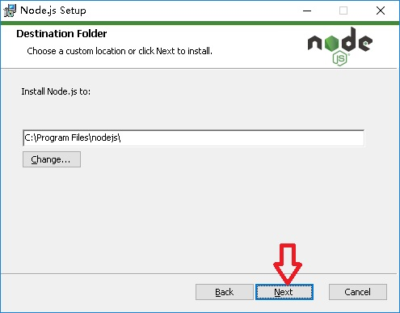
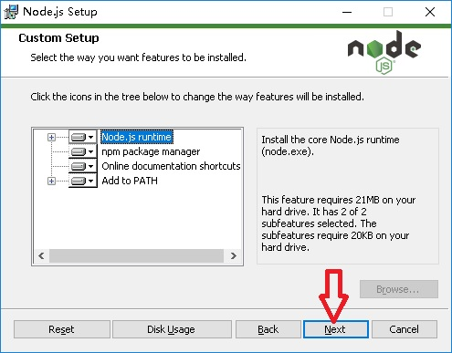
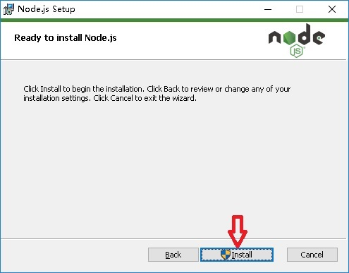
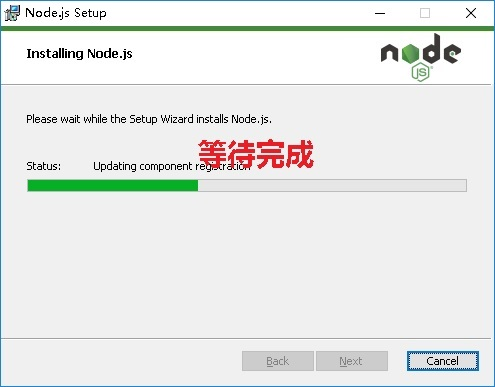
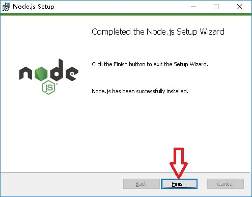

# nodejs初学者入门教程
## windows安装nodejs
点击[nodejs官方网站](https://nodejs.org)下载(如图)，一般选择LTS版本，这个是长期支持的稳定版本
***

***
安装过程图示
***

***
测试安装的结果，按`winkey+r`打开运行对话框，输入`cmd`后确定，在打开的命令行中输入`node -v`会看到安装的node版本,输入`npm -v`会看到npm的版本
## 第一个nodejs程序
- 在任意目录创建一个[hello.js](study/hello.js)的javascript文件
- 编辑内容`console.log("nodejs你好");`，和标准的js一样的语法
- 在上文中打开的命令行中输入`cd hello.js所在的目录 `，切换到js文件所在目录，执行`node hello.js`
- 第一个node程序就成功的完成
***
## 使用nodejs搭建http服务器
- 创建[HttpServer.js](study/HttpServer.js)文件
- 内容：  
//引用http模块  
var http = require('http');  

//创建服务器
var server = new http.Server();  
  
//处理请求  
server.on('request', function(req, resp) {  
    console.log(req.url);  
    //设置应答头信息  
    resp.writeHead(200, {  
        'Content-Type': 'text/html'  
    });  
    //输出内容  
    resp.write('请求的url' + req.url);  
    //结束应答  
    resp.end();  
});  
  
//启动监听  
server.listen(9000);  

- 执行`node HttpServer`启动服务器
- 打开浏览器输入`http://127.0.0.1:9000`
## nodejs插件
#### 中国特色
由于中国网络的原因，官方的插件安装都在国外，会非常的缓慢，幸运的是阿里巴巴为广大的开发者提供了npm的中国区完整镜像，[npm淘宝镜像的官网](http://npm.taobao.org/)  
在命令行中执行`npm install -g cnpm --registry=https://registry.npm.taobao.org`安装中国版npm并指定安装源为淘宝镜像  
安装完成后执行`cnpm -v`测试是否安装成功  
题外话，阿里巴巴也提供maven的中国镜像，所以我是阿里的粉丝（fastjson，规约插件等等。。。我就不说了）
#### 第一个插件，[浏览器同步工具](http://www.browsersync.cn)
- 在命令行中输入`cnpm install -g browser-sync`开始安装全局的浏览器同步工具
- 创建一个[目录](study/browser-sync/)放置网页
- 编写一个[html文件-index.html](study/browser-sync/index.html)
- 在命令行中输入`cnpm install --save-dev browser-sync`安装项目中使用的浏览器同步工具
- 在命令行中输入`browser-sync start --server --files "*.css, *.html,*.js"`启动插件
- 启动完成后，每次保存修改--files参数后面指定的文件，浏览器都会自动刷新
